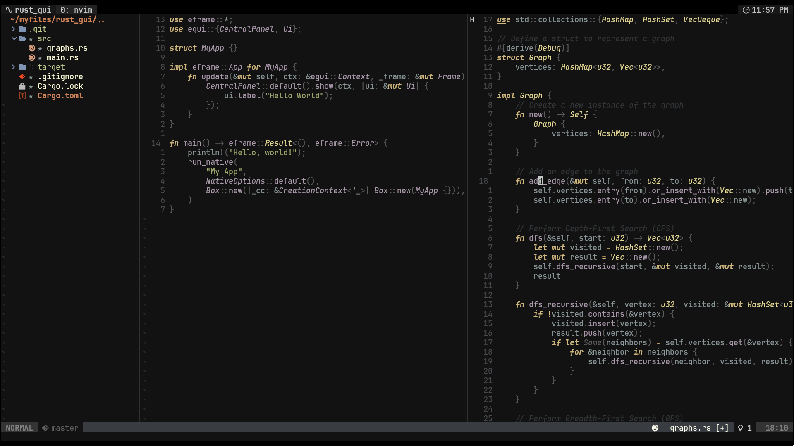
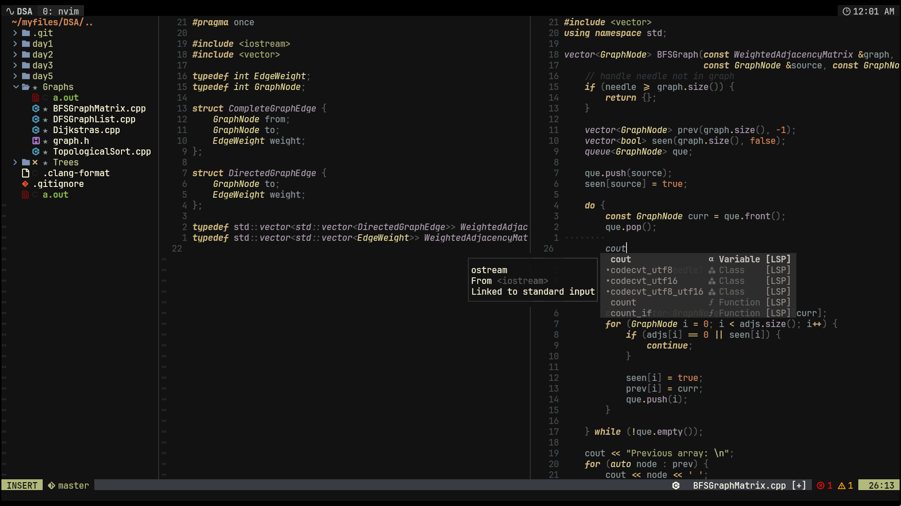

# Cosec Twilight - A Lush Theme For Neovim

A recreation of twilight theme using [lush](https://github.com/rktjmp/lush.nvim).
The existing twilight colorschemes were not that great in my opinion, since some
highlight groups were missing, so I made my own :D

## Screenshots

Rust:



C++:



## Installation

You can use any package manager you want, for example:

Using `lazy`:

``` lua
return {
    "CosecSecCot/cosec-twilight.nvim",
    -- no setup function required (didn't make one :P)
    -- (you can change and customize it using lush according to your preference)
}
```

Using `packer`:

``` lua
use {
    "CosecSecCot/cosec-twilight.nvim",
}
```

## Usage

To use this colorscheme simply type ```:colorscheme cosec-twilight```

or add this code in your config file:

```vim
" Vimscript
colorscheme cosec-twilight
```

or

```lua
-- Lua
vim.cmd [[colorscheme cosec-twilight]]
```
